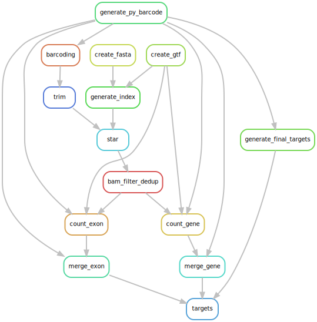

# EasySci RNA Pipeline

A Snakemake pipeline for processing [JunyueCaoLab/EasySci](https://github.com/JunyueCaoLab/EasySci) methods. (Paired End ONLY)

## Running the Pipeline

Run with 48 threads and use conda environments defined in the Snakefile.

```bash
snakemake --use-conda -c 48
```

## Before Running

1. Install [snakemake](https://github.com/snakemake/snakemake)
2. Put your FASTQ files in the `input/fastqs` directory.
3. Generate `input/i7_demux_prefix.txt`
    - Go to the `input` directory and run: `./rename_fastqs.sh`
4. Update the `input/Barcodes.xlsx` file with your sample plate info.
5. Change the `config.yaml` file to your needs.

### Input Fastqs

EasySci and sci-RNA-seq use the combination of RT, ligation, I7 barcodes to determine cells. If you use both I7 and I5 for demultiplexing, you will get 96 * 256 = 24576 files. So the pipeline first only demultiplexes the I7 barcodes, and then demultiplexes the I5 and RT barcodes in barcoding step.

```bash
bcl2fastq --runfolder-dir INPUT_FOLDER -o OUTPUT_FOLDER --sample-sheet SAMPLE_SHEET --reports-dir OUTPUT_FOLDER/report --barcode-mismatches 1 --create-fastq-for-index-reads --no-lane-splitting --use-bases-mask Y*,I*,Y*,Y* --minimum-trimmed-read-length 0 --mask-short-adapter-reads 0
```

`--use-bases-mask Y*,I*,Y*,Y*` means:

- `R1`: Read 1 (UMI + RT barcode + cDNA)
- `I1`: Index 7
- `R2`: Index 5 (Ligation barcode)
- `R3`: Read 2 (cDNA)

### config.yaml

Please check the `config.yaml`

|Goal|Parameter|Description|
|----|--------|-----------|
|Generate gene count| `output_type.gene`| `true` or `false`|
|Generate exon count| `output_type.exon`| `true` or `false`|
|Use prebuilt STAR index| `prebuilt_star_index`| absolute path to star index folder or keep it default |
|Fasta file| `fasta_file`| absolute path or URL (can be gzipped) |
|GTF file| `gtf_file`| absolute path or URL (can be gzipped) |
|Read length| `seq_length`| used for STAR index generation |

NOTE:

- Please use gunzipped local fasta and gtf files (The script will create symlinks to them. If not, it will unzip them).
- If `prebuilt_star_index` is set, the fasta will not be used, but the gtf file will still be used for counting.

## Rule Graph



## References

- EasySci Nature Genetics [https://doi.org/10.1038/s41588-023-01572-y](https://www.nature.com/articles/s41588-023-01572-y)
- [EasySci PhD Thesis](https://digitalcommons.rockefeller.edu/student_theses_and_dissertations/778/)
- repo [JunyueCaoLab/EasySci](https://github.com/JunyueCaoLab/EasySci)
- repo [JunyueC/sci-RNA-seq3_pipeline](https://github.com/JunyueC/sci-RNA-seq3_pipeline)
- [Sci-RNA-seq Structure - Teich Lab](https://teichlab.github.io/scg_lib_structs/methods_html/sci-RNA-seq_family.html)

## Snakemake Tips

Run on slurm clusters (not tested yet):

```bash
snakemake -j unlimited \
  --use-conda \
  --cluster "sbatch --job-name={rule} --cpus-per-task={threads} --mem={resources.mem_mb} --time={resources.runtime}" \
  --latency-wait 60
```

`--rerun-triggers mtime` is useful for debugging to rerun rules based on file modification times.
