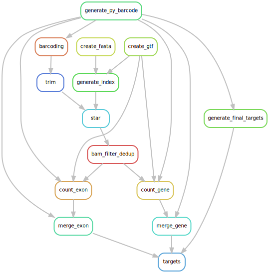

# Snakemake Tips

Debug:

```bash
snakemake -c 84 --use-conda --rerun-triggers mtime
```

## Snakemake Options

- `-c, --cores {threads}`: You need to specify the number if you run local jobs.
- `--use-conda`: Use conda environments defined in the Snakefile.
- `--rerun-triggers {code,input,mtime,params,software-env}`: Specify which triggers to use for rerunning rules.

## Rulegraph



## Tips

Use `--rerun-triggers mtime` for debugging to rerun rules based on file modification times.

### Rule vs Checkpoint

Rules are for static tasks. Checkpoints are for dynamic tasks that depend on the output of previous rules.

In this pipeline, checkpoint `generate_final_targets` is used to determine which species to process based on the content of `config["rt_barcode_tsv"][species]`. If human's tsv is empty, the pipeline will not run the human alignment and counting rules.

